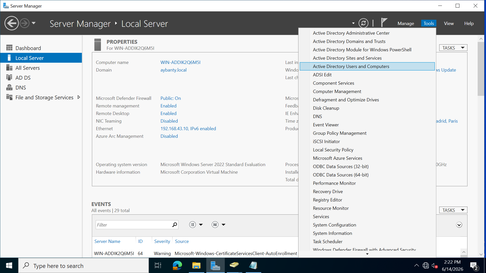
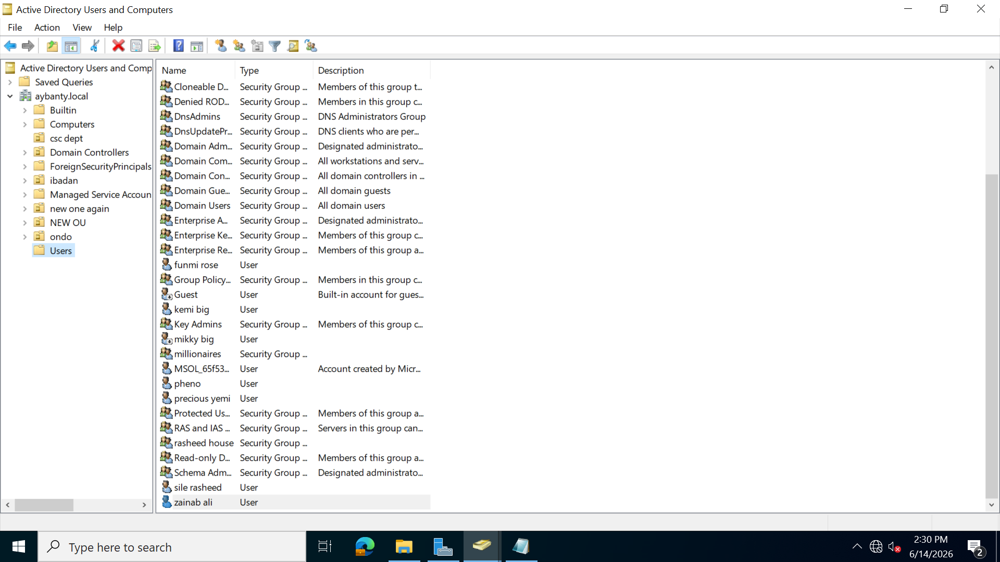

i logged in to my domain controller hosting the active directory server. i clicked on the server manager then select active directory and users.
 
 **This is my active directory and users page**
  
