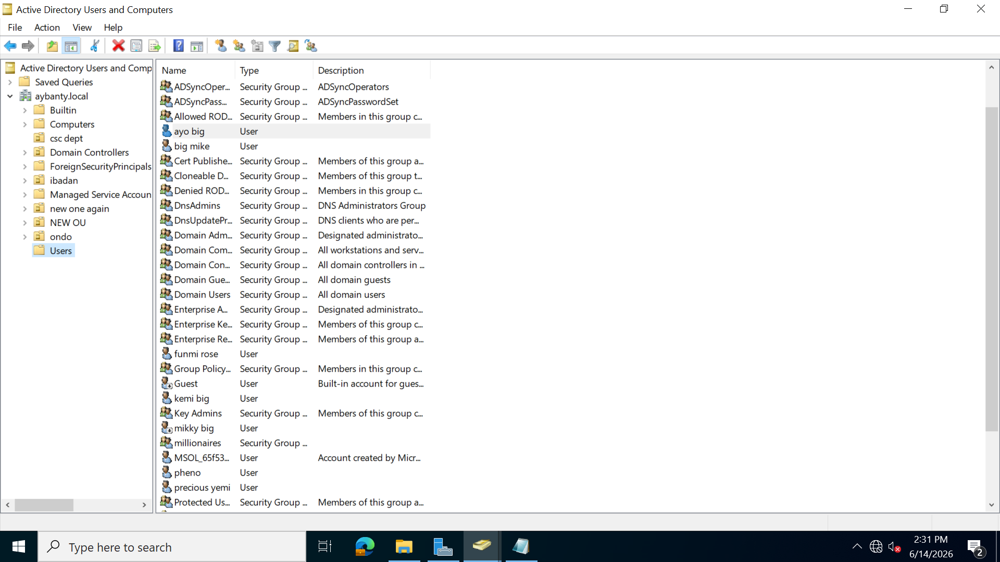
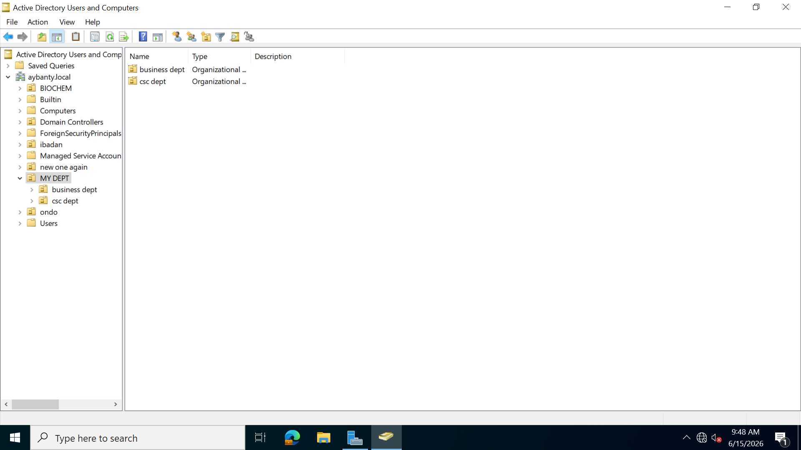
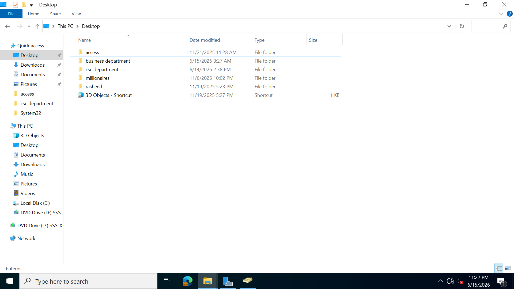
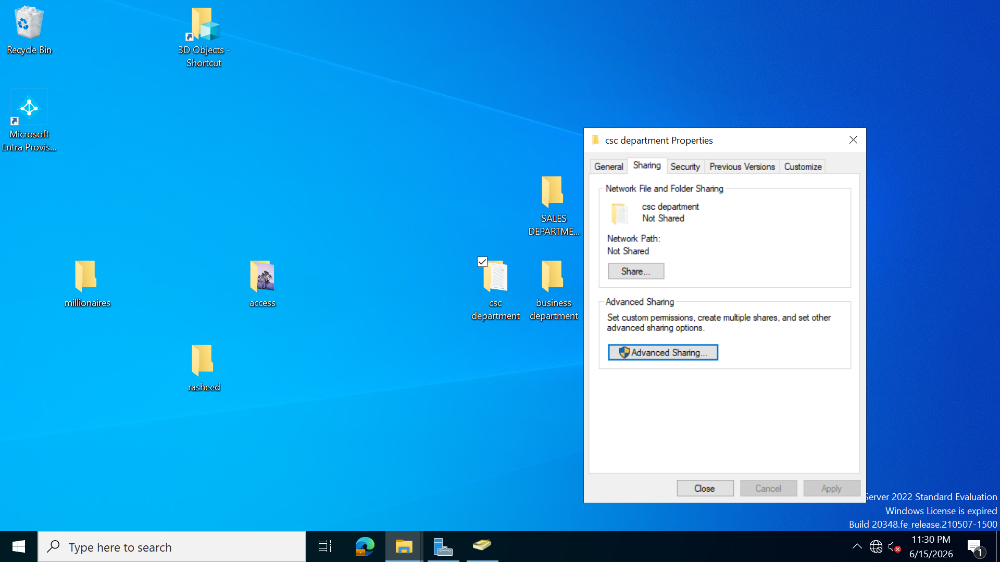
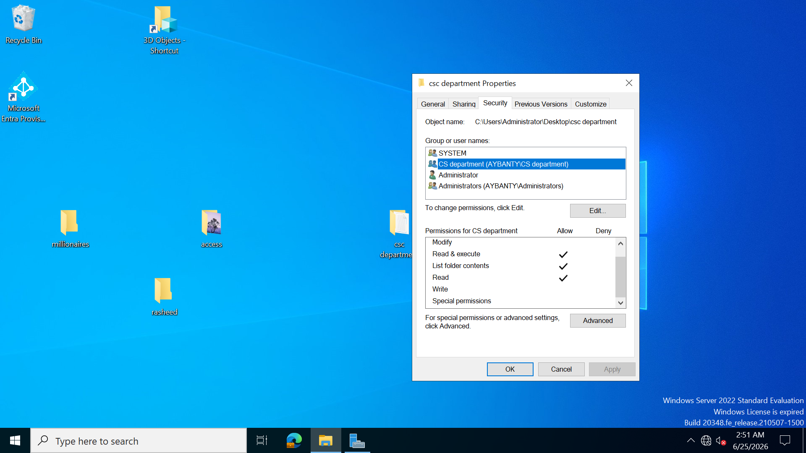
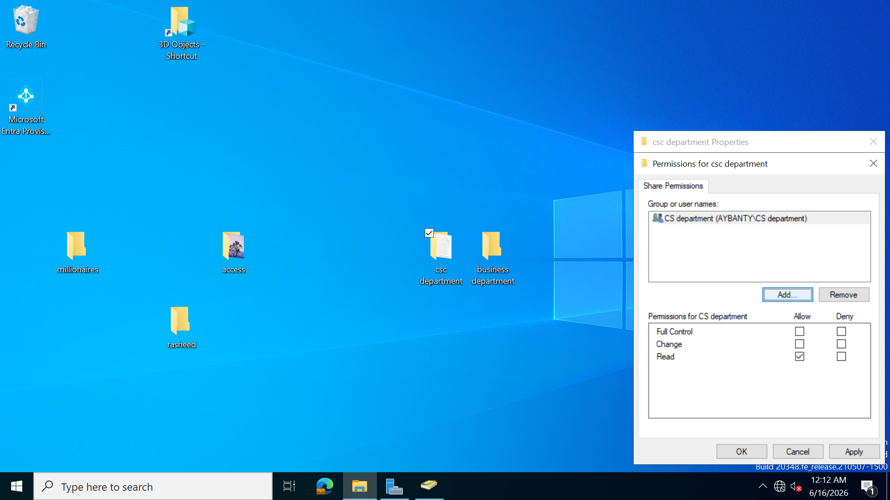
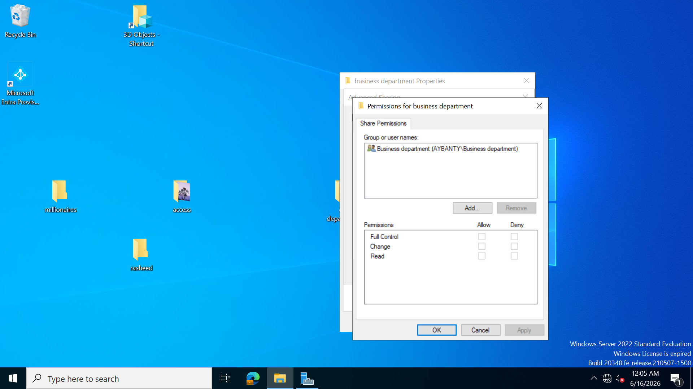
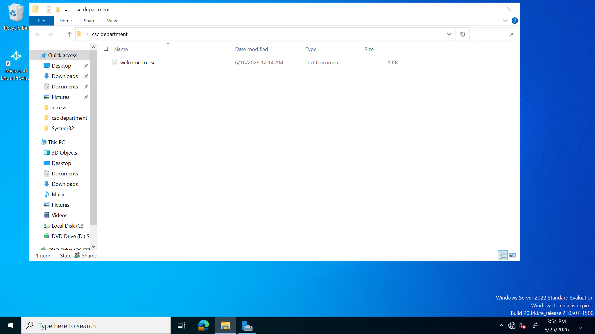

i go to users and i already created a list of users

I created two groups which i added users to, these groups are in two different organization units called the business dept and csc dept which is in a single entity OU called MY DEPT

in the business OU which is the organizational unit ,there is a business department group

in the csc department we have the csc dept group

i created two folders named csc dept and business dept respectively which i allowed shared access to the security groups each, in which only members can access each

for the csc file folder i added the csc security group in it. i shared the folder by right clicking , going to properties and using advanced sharing
  
i also added the group in the security tab by giving it the necessary permission

shared folder to csc department security group with only  a read access permission
 
i repeated the same process for the business department but only shared to the business department group
  
so lets see if members of the security and non members can access this folder
This is what is inside the csc dept shared folder
