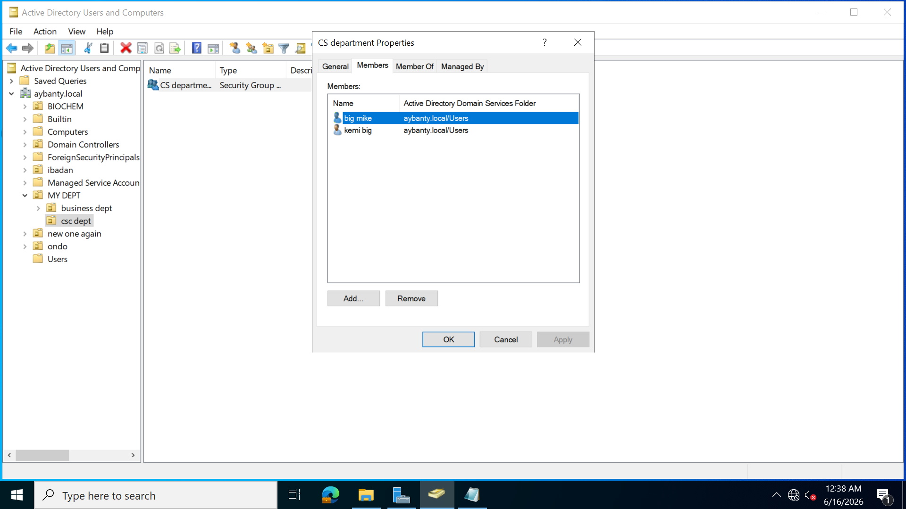

## ACCESSING SHARED CONTENTS ##
I addded two members to each group,so starting with the csc department
, i will login to the user big mike to see if it can access the shared folder

when i logged in into the user, i clicked on pc in the file folder and clicked on the map network drive to see if i can access the folder, then i wrote the shared folder pathname, when it showed me the list of folders available, i clicked on the csc file folder , it didnt say i dont have access but the folder wasnt opening while the business department file folder i clicked on ,it says i have no access  
.png>)
.png>)
.png>)  
** i couldnt access the business department folder here**  
.png>)  
.png>)  
since i couldnt access the folder directly through the map network drive part , i pasted the folder path name on the address search address bar. i clicked on pc and edited the address by pasting the file folder path
.png>)
the file folder pathname took me directly to the files in there which i can read and access 
.png>)
i also decided to see if i can access the business department folder to see if i can acccess it, i pasted the folder share pathname to the address searh bar as i did for the csc department folder. I wasnt given permission to access the folder.
.png>)
.png>)
