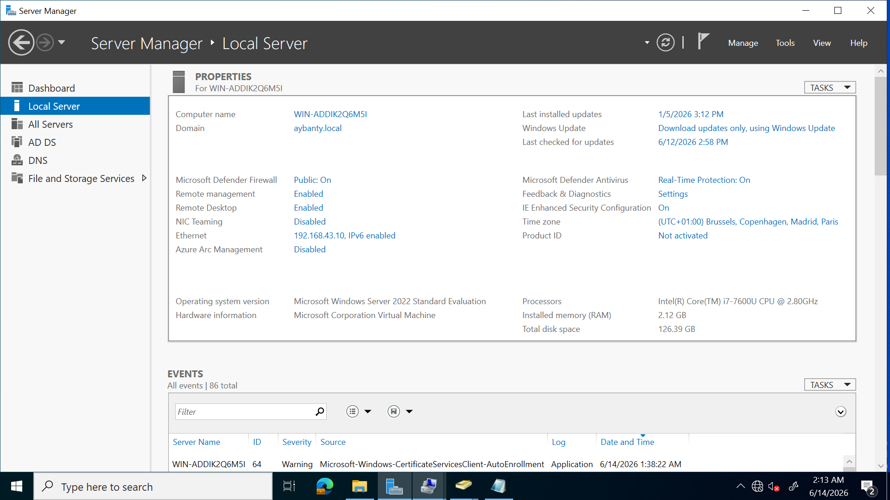
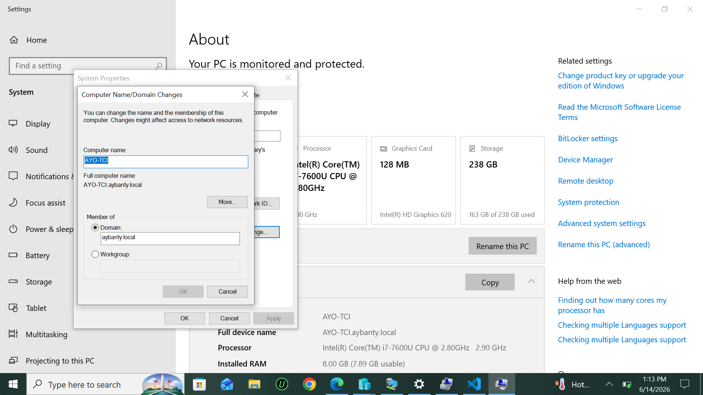

#  CREATING  ROLE BASED ACCESS CONTROL (RBAC) USING ACTIVE DIRECTORY
RBAC is an act of regulaating access to a computer or network resources based on the roles of individual users within an organization.  
Active directory is a centralized used by adminsistrators to manage users , computers and other resources on a network.

To be able to performe this operation, i already made sure my client computer is joined to the domain of my active directory which is a local domain.   
**here is a picture of my local domain name on active directory which is aybanty.local**
 
 **window joined to the local domain**    
   
 so in my active directory, i already created a list of users to be divided into groups whereby. The groups are allowed a shared access  to a file folder or more  whereby only members of the same group can access the same folder content and a different group cannot access the same folder unless given acccess e.g A folder assigned to group A cant be accessed by group B.
 